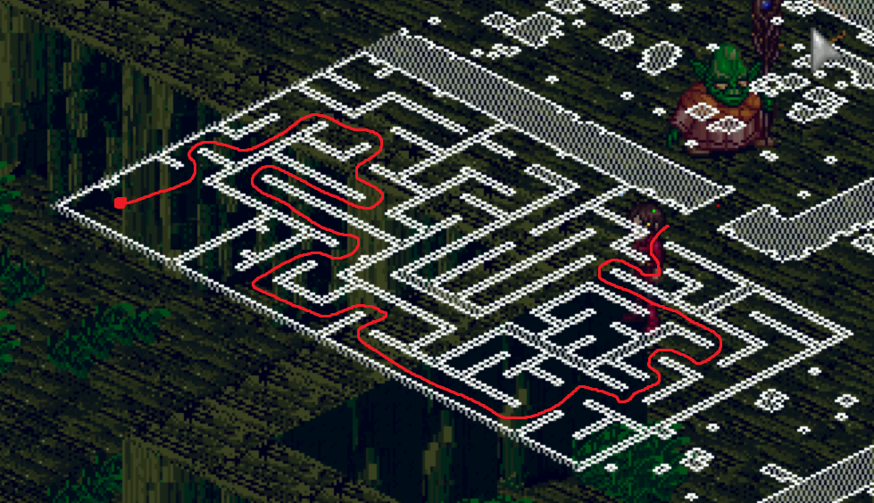

# Swamp Maze

## Rewards

- 25,000 Experience
- A Mushroom Hat

## Walkthrough

- Head to the Wilderness (south of Mileth) and speak to Koda (58,197)
- Select "I'll keep an eye out for him."
- Traverse through to the end of the maze to find Koda

!!! tip

    Here's a map to find him. { width="400"; align=left }

- Speak to Joda at 5,247
- Select "You know those are poisonous right?"
- Select "Your brother has been worried about you."
- Select "uhh ok well good luck with that."
- Select "Oh. Thank you I guess. How do we get out?"
- Select "Then why are you still here?"
- Select "Right... Well I'll be on my way."
- Exit the maze by using the hidden entrance behind Joda at 1,245
- Speak to Koda to complete the quest
