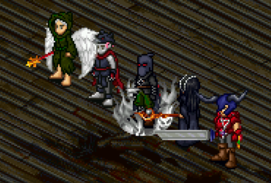

# Pentagram

## Rewards

- Pentagram armor (level 60)
- Legend mark: Completed the Pentagram Quest
- 500,000 experience (received throughout the quest)

## Walkthrough

!!! info

    To start this quest, you will need a party that consists of one of each class: Warrior, Rogue, Wizard, Priest, Monk.

### Signing the Pact

- Head to the Loures Library
- With your party present, click the bookcase at 1,13 to start the quest
- Select "Open the book"
- Click "Next"

!!! info ""

From here, each class will have their own unique dialogue and responsibilities for the ritual. The dialogue indicates you must head to the summoning room, where the Macabre Pentagram lies. Each member must stand in a specific spot on the outside of the Pentagram, which has been told to you (and can be found within this walkthrough). To start, each party member must sign a pact by entering their character name.

!!! info ""

??? note "Special note for Wizards"

    Wizards are special and have an additional responsibility the other classes don't. You must collect 2 Zombie Flesh and place them two spaces north of where you stand in the ritual. Zombie Flesh can be found on your way to House Macabre. Anyone in the party can help you collect these, but the Wizard will need them when you get to your destination.

### Starting the Ritual

- Head to House Macabre
- Walk north to the House Macabre Central Graveyard and then East to the House Macabre East Graveyard
    - Be sure to kill zombies along the way until you have 2 Zombie Flesh, which the Wizard will need for their part of the ritual
- Head to 93,12 and enter the house (Macabre Study 4-2)
- Walk on top of the broken floor boards at 1,13 to get into the Macabre Pentagram room
- From here, each class must stand in a specific position to initiate the first part of the ritual:
    - Monk: 6,11
    - Warrior: 7,7
    - Rogue: 11,6
    - Priest: 13,10
    - Wizard: 10,13

!!! tip "Class coordinates"

    Here is a copy/pastable message you can send to your party for coordinates:

        Monk 6,11; Warrior 7,7; Rogue 11,6; Priest 13,10; Wiz 10,13

- Once everyone is in place, the Wizard must drop the 2 Zombie Flesh two tiles directly north of them (10,11)
- This will trigger a pop-up with some dialogue
- Once read, everyone in the party will need to shift places _clockwise_ two times. This means that you should end up at these new coordinates:
    - Monk: 11,6
    - Warrior: 13,10
    - Rogue: 10,13
    - Priest: 6,11
    - Wizard: 7,7

!!! tip "Shifted class coordinates"

    Here is a copy/pastable message you can send to your party for the second set of coordinates:

        Monk 11,6; Warrior 13,10; Rogue 10,13; Priest 6,11; Wiz 7,7

- Once everyone is in position, this will trigger a pop-up
- Select "Listen closely"

From here, each class will receive a different message pertaining to a clue where you can find a piece of the pentagram to collect. The clue you are given is for the class that _originally_ stood in the spot prior to you shifting two spaces clockwise.

!!! tip "Who gets each clue?"

    - Monks will receive the Rogue's clue
    - Warriors will recieve the Priest's clue
    - Rogues will receive the Wizard's clue
    - Priests will recieve the Monk's clue
    - Wizards will recieve the Warrior's clue

### Class Clues

Here is where each class will need to go to pick up their piece of the Pentagram:

#### Warrior

Walk up to a withered tree in Cthonic Remains (CR) 1 @ 7,62

#### Rogue

Head to Cthonic Remains (CR) 1 @ 79,70

#### Wizard

Head to East Graveyard Macabre and enter the house at 21,38. Inside of Macabre Study 4-1, walk to 8,2.

#### Priest

Head to Cthonic Remains (CR) 2 @ 59,26. Directly in front of the coordinates is a single pillar with flame on top of it.

#### Monk

Head to West Graveyard Macabre and enter the house at 60,52. Inside of Macabre Cellar 2-3, walk to 5,1.

!!! tip "Coordinates for each class"

    Here are some quick messages you can send your group:

        Warrior: Go to CR-1 @ 7,62. Walk to the withered tree.
        Rogue: Go to CR-1 @ 79,70.
        Wizard: Go to East Macabre 21,38. Inside, go to 8,2.
        Priest: Go to CR-2 @ 59,26. Walk to pillar with flame.
        Monk: Go to West Macabre 60,52. Inside, go to 5,1.

### Crafting the Pentagram

Before starting this section, each class is going to need obtain a specific type of Pristine gem:

- Warrior: Pristine Ruby
- Monk: Pristine Beryl
- Priest: Pristine Sapphire
- Wizard: Pristine Heartstone
- Rogue: Pristine Emerald

Arrange the items to make sure each class has the appropriate Pristine gem in their inventory.

Once everyone has their Pristine gem and Pentagram piece:

- Go to the Rucesion Jewelry Shop (20,10)
- Speak to Celestia
- Select "I found this."
- Select "Can you empower it?"
- Select "I have to do this."
- Select "What gem should I empower this with?"

!!! info ""

Celestia will explain what gem each class needs, although we've already organized this above.

!!! info ""

- Speak to Celestia again
- Select "I have the Pristine Gem."

!!! info ""

Celestia will then add the gem to your Pentagram piece. She tells you to visit the forge in Tagor and speak to Thorin (28,77)

!!! info ""

!!! note ""

Wizard should be the last person to speak to Thorin as they will receive the finished Pentagram.

!!! note ""

- Head to Tagor and speak to Thorin at the Forge (28,77)
- Select "Will you help us craft the Pentagram?"
- Select "We will face the darkness together"
- Select "They spoke to us, we must do this."
- Select "Here are all the pieces."

!!! info ""

Thorin crafts us the finished Pentagram and hands it to the Wizard in the group.

!!! info ""

### Performing the Ritual

!!! danger ":material-emoticon-devil-outline: Boss ahead!"

- Head back to House Macabre East Graveyard (93,11)
- Go down at 1,13
- Stand back in your original spots, prior to the clockwise shift
- When the group is all in position, the Wizard uses the Pentagram by double-clicking it, which will summon the boss
- Slay the Soul Eater
- Once the boss has been defeated, the quest has been completed

Everyone in the group will receive their own class-specific armor:

- Wizard: Female Lich Robe, Lich Hood
- Monk: Nagatier Jaw, Male Nagatier Cloak
- Priest: Female Dark Cleric Robes, Dark Cleric Brim
- Rogue: Male Reiter Mail, Kopfloser Hood
- Warrior: Male Scarlet Carapace, Scarlet Chitin Helmet (missing in screenshot!)

