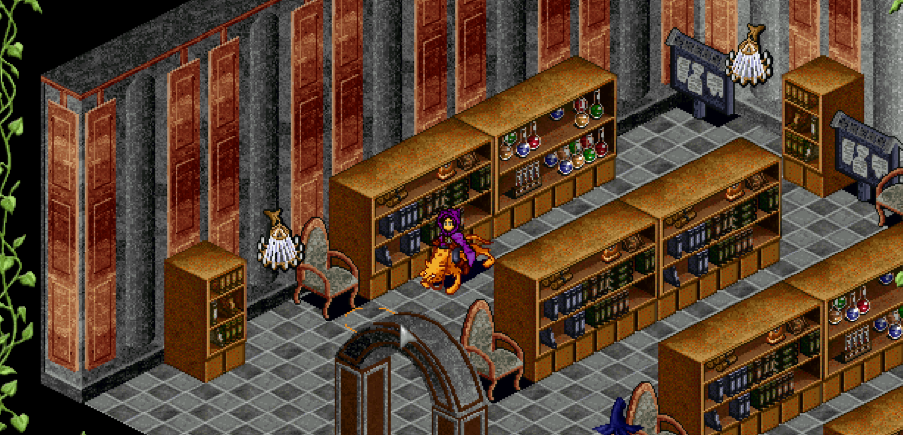

# Suomi Tavern

## Rewards

- 25,000 Experience
- 8% chance to obtain "Loved by Suomi Mundanes" legend mark

## Cooldown

This quest has a 22 hour cooldown.

## Walkthrough

- Head to Suomi and visit the Suomi Inn (82,15)
- Speak with Viveka to start the quest
- Select "Hey, do you have a moment?"
- Select "Sure. What would you like to eat?"
- Select "I know just the thing."
- Select "It'll be a surprise, be back soon."
- Viveka wants a cherry pie, which needs 50 Cherries and 1 Flour to create
    - Cherries can be purchased from restaurants (500 gold each) or harvested in the Suomi farm
    - Flour drops from Mythic and floor bosses

!!! tip

    { width="400"; align=right }

    If you don't know how to make a Cherry Pie with the cooking profession yet, you will need to learn the recipe first. You can learn it in the Loures library. The recipe is on the far left shelf in the middle. Click on the bookshelf to find the cook book, which will teach you the recipe.

- Craft the cherry pie at the Mileth kitchen
- Return to Viveka in Suomi and give her the Cherry Pie to complete the quest
